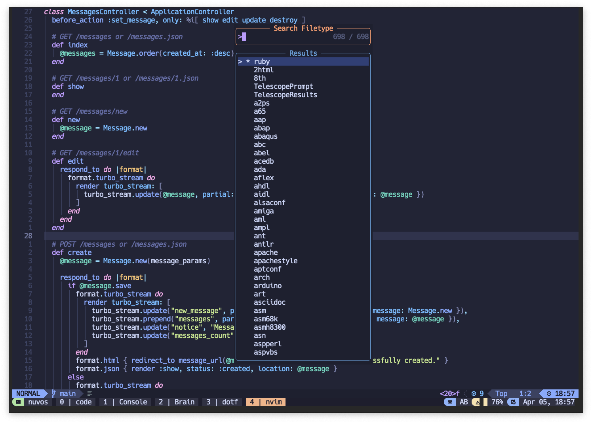

# telescope-filetypes.nvim

An NeoVim plugin that lets you easily switch between filetypes.



Disclaimer 1: The functionality this plugin provides is already available in Telescope (with the `filetypes` builtin - see [Telescope docs](https://github.com/nvim-telescope/telescope.nvim?tab=readme-ov-file#vim-pickers)), I didn't realize that until I was reading the docs to learn how to register mine as a Telescope extension. 🤡

Disclaimer 2: I built this in less than 4 hours on a Thursday midnight without any knowledge on Lua or NeoVim plugins, do not expect much. This is my first attempt trying to contribute to the NeoVim ecosystem. Also there are no specs, I'll find some spare time to learn how to write them.

One difference though is that this plugin display the current file type at the top of the picker prefixed with an `*`, so you can easily see what's the current file type. Very helpful in my opinion.

I'd recommend using Telescope's `filetypes` instead of this plugin, but if you want to give it a try, feel free to do so.

## Installation with Lazy

```lua
{
  "rtalexk/telescope-filetypes.nvim",
  dependencies = {
    "nvim-telescope/telescope.nvim",
  },
  config = function()
    require("telescope").load_extension("syntax_picker")
    local file_syntax = require("file_syntax")
    file_syntax.setup()

    vim.keymap.set("n", "<leader>fs", file_syntax.show_picker, { desc = "File type/syntax" })
  end,
}
```
